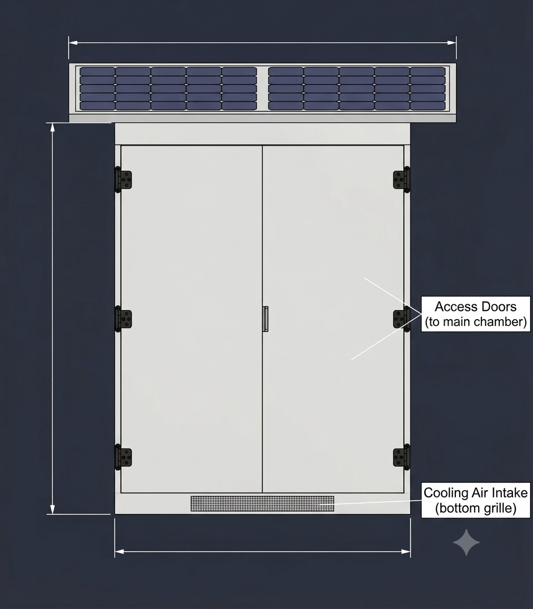
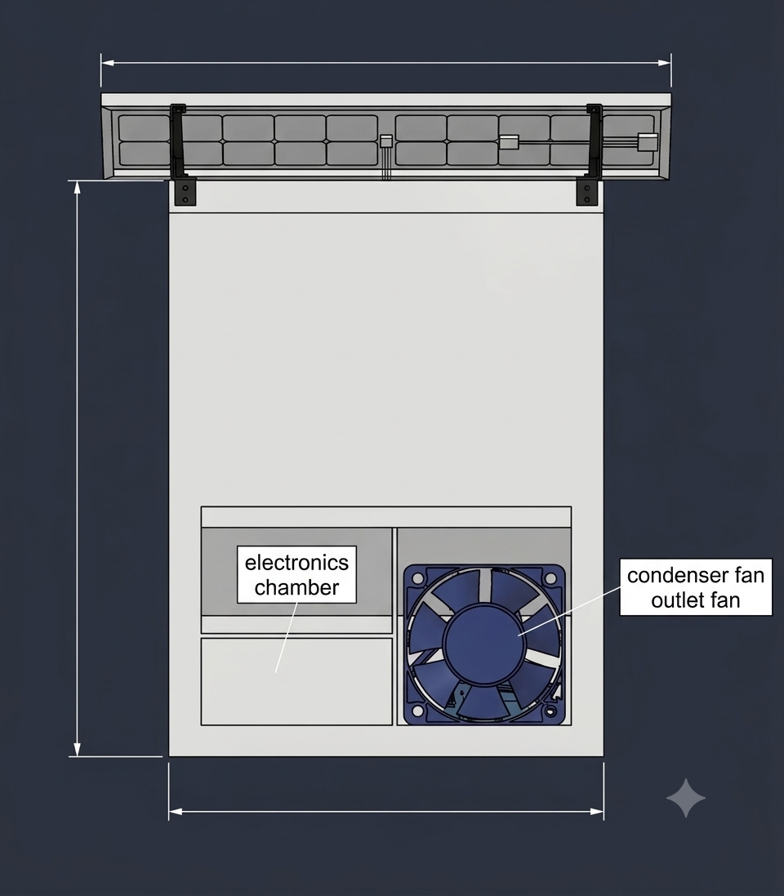
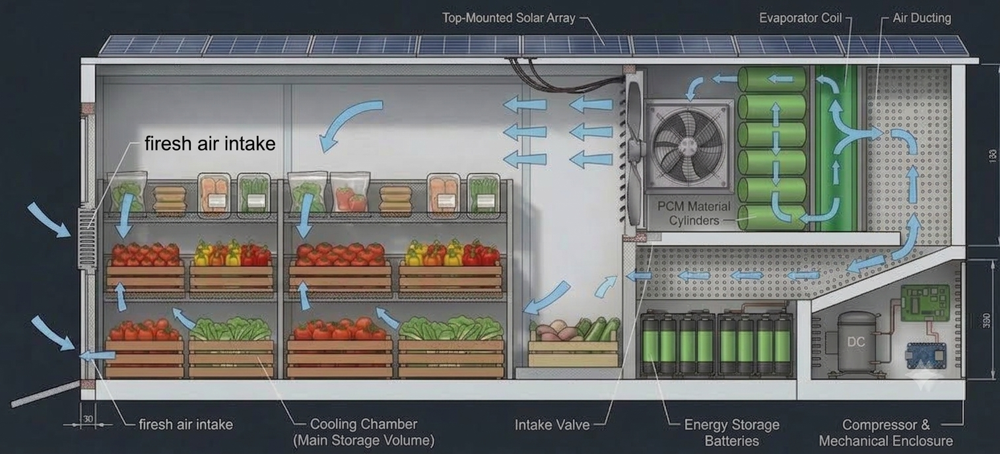

# Solar-Powered Phase Change Material (PCM) Cold Storage System

An off-grid, solar-powered refrigeration system designed for post-harvest agricultural preservation using Phase Change Materials (PCM) for thermal energy storage and intelligent airflow management.

---

## 📐 System Views & Diagrams

### Front View — Main Chamber & Air Intake

*Front elevation displaying the top solar array, main access doors, and bottom cooling air intake grille.*

### Rear View — Mechanical & Electronics Enclosures

*Rear elevation showing the electronics chamber and condenser outlet fan assembly.*

### Cross-Section — Airflow & Thermal Management

*Internal schematic highlighting the PCM cylinders, evaporator coil, air ducting loop, and battery/compressor compartments.*

---

## 📌 System Overview

This project provides a hardware and system architecture for a self-sustaining cold storage unit tailored for fresh produce (e.g., fruits, vegetables). The system integrates direct solar power, battery storage, and Phase Change Material (PCM) thermal cylinders to maintain optimal storage temperatures while minimizing energy consumption.

---

## 🏗 System Architecture & Key Components

### 1. External Enclosure & Structural Design
* **Top-Mounted Solar Array**: Captures solar energy to run the compressor and power thermal storage charging cycles.
* **Access Doors**: Dual hinged front doors providing access to the main storage chamber.
* **Electronics & Mechanical Chamber**: Rear compartment housing the main control board, power electronics, DC compressor, and condenser system.
* **Fresh Air & Cooling Intake**: Bottom grille air intakes to manage ambient fresh air exchange and internal circulation.

### 2. Thermal Energy & Power System
* **Phase Change Material (PCM) Cylinders**: Thermal energy storage unit that freezes during peak solar hours and releases cold energy during low-sun periods to maintain target temperatures.
* **Energy Storage Batteries**: Onboard DC battery bank for electrical backup and continuous controller operation.
* **DC Compressor**: Variable-speed compressor engineered for direct DC integration from solar/battery sources.

### 3. Airflow & Climate Control
* **Evaporator Coil**: Works in tandem with the PCM cylinders for heat absorption during active cooling cycles.
* **Air Ducting & Circulation Fans**: Directs cold air down through the bottom plenum and up through the produce crates, ensuring uniform cooling.
* **Condenser & Outlet Fans**: Exhausts waste heat from the mechanical enclosure to maintain system efficiency.
* **Intake Valves**: Regulates fresh air exchange to control internal humidity and gas concentrations.

---

## 🔄 Airflow & Thermal Operating Loop

1. **Refrigeration & Charging Phase**: The compressor runs via solar power, cooling the evaporator coil and freezing the PCM material cylinders.
2. **Cold Air Distribution**: Circulating fans push air past the evaporator coil and PCM cylinders through dedicated air ducting.
3. **Chamber Circulation**: Cold air enters the main storage volume beneath the crates, cooling the stored produce from bottom to top before returning to the cooling loop.
4. **Thermal Storage Mode**: During solar outages or nighttime, the melted/freezing PCM maintains the chamber temperature, significantly reducing reliance on battery power.

---

## 🛠 Features

- **Off-Grid Operation**: Fully functional using solar energy paired with PCM thermal storage.
- **Thermal Inertia**: Extended cooling retention during zero-power periods using PCM cylinders.
- **Optimized Air Distribution**: Ducted airflow ensures uniform cooling throughout multi-tiered produce racks.
